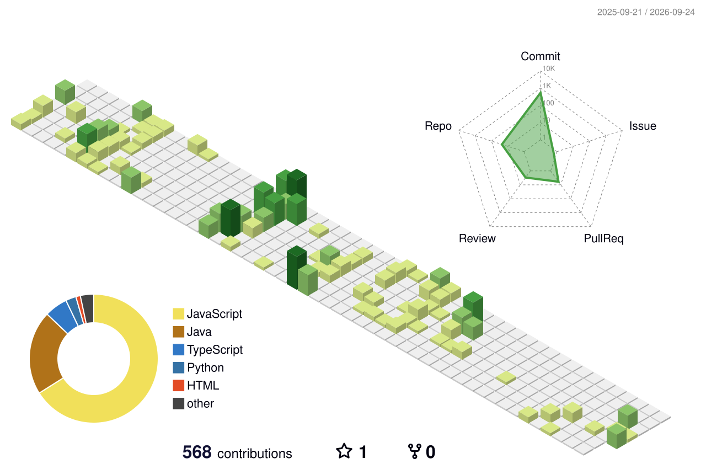

# Bhabin Dulal

### Full-Stack Developer | MERN | Applied AI/ML

  
  
  
  

---

## About Me

I’m **Bhabin Dulal**, a BSc (Hons) Computing student at Itahari International College (IIC), affiliated with London Metropolitan University.

I build full-stack applications with the MERN stack and explore applied AI/ML.

---

## Tech Stack

### Frontend

  

### Backend

  

### Databases

  

### AI / ML

  
  

### Tools

  

## GitHub Analytics

  
  

  

  <picture>
    <source media="(prefers-color-scheme: dark)" srcset="profile-3d-contrib/profile-night-green.svg">
    <source media="(prefers-color-scheme: light)" srcset="profile-3d-contrib/profile-green.svg">
    
  </picture>

Yearly contribution flow in motion

  <picture>
    <source media="(prefers-color-scheme: dark)" srcset="https://raw.githubusercontent.com/bhabinexpert/bhabinexpert/output/github-snake-dark.svg">
    <source media="(prefers-color-scheme: light)" srcset="https://raw.githubusercontent.com/bhabinexpert/bhabinexpert/output/github-snake.svg">
    
  </picture>

---

## Let's Connect

  <a href="https://bhabindulal.com.np">Portfolio</a> ·
  <a href="https://www.linkedin.com/in/bhabindulal/">LinkedIn</a> ·
  <a href="mailto:bhabindulal35@gmail.com">Email</a>

---

Building useful software, learning continuously, and exploring where full-stack engineering meets applied AI.

